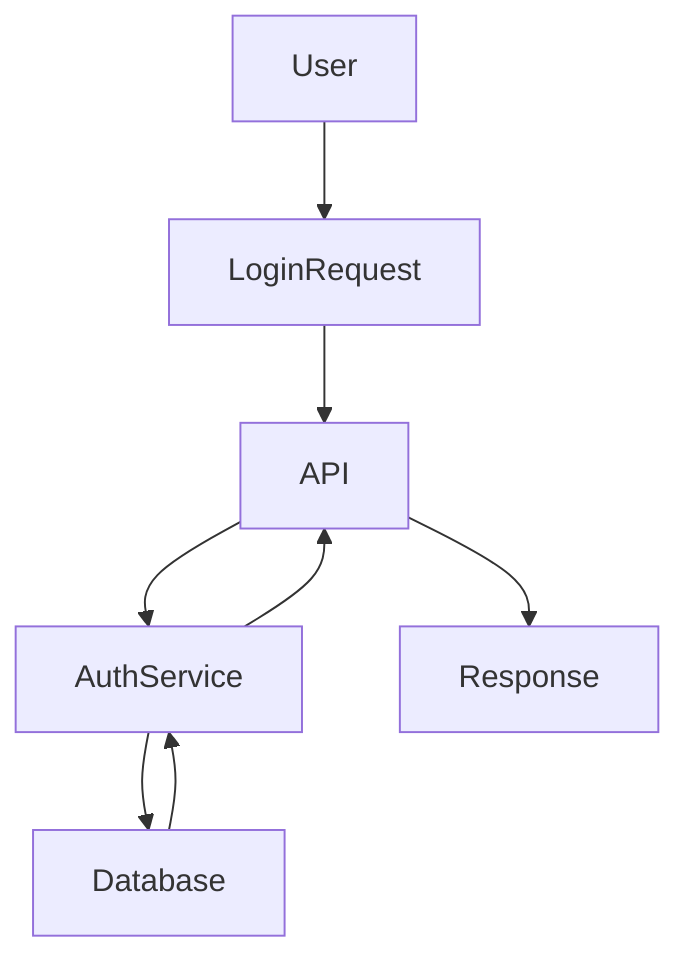
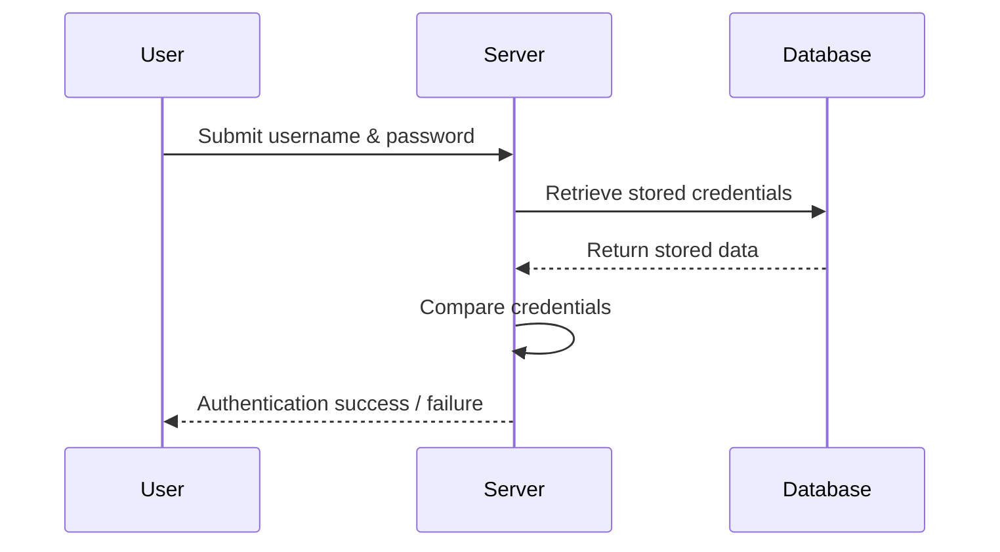
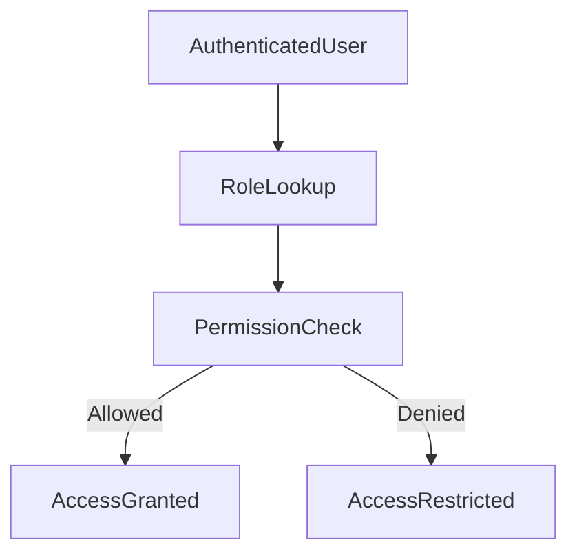

# 🔐 Authentication and Authorization
### Backend Security Fundamentals

---

## 📑 Table of Contents

- [Overview](#overview)
- [Core Concepts](#core-concepts)
- [Authentication](#authentication)
- [Authorization](#authorization)
- [Secret Club Analogy](#secret-club-analogy)
- [Authentication Architecture](#authentication-architecture)
- [Authentication Flow](#authentication-flow)
- [Authorization Flow](#authorization-flow)
- [Components of an Authentication System](#components-of-an-authentication-system)
- [Real World Example](#real-world-example)
- [Summary](#summary)
- [Key Takeaways](#key-takeaways)

---

# 1️⃣ Overview

In modern backend systems, **security is one of the most critical responsibilities of the server**.

Two fundamental mechanisms protect applications and user data:

- **Authentication**
- **Authorization**

These processes work together to ensure that:

1. The system knows **WHO the user is**
2. The system controls **WHAT the user can do**

| Concept | Meaning |
|------|------|
| Authentication | Identity verification |
| Authorization | Permission control |

Authentication verifies identity.  
Authorization determines permissions.

---

# 2️⃣ Core Concepts

## Authentication vs Authorization

```
User Request
     │
     ▼
Authentication  →  Verify Identity
     │
     ▼
Authorization   →  Check Permissions
     │
     ▼
Access Granted / Denied
```

Authentication must always occur **before authorization**.

---

# 3️⃣ Authentication

Authentication is the process of **verifying the identity of a user**.

It answers the question:

> **Who are you?**

When a user attempts to access a system, they must prove their identity using **credentials**.

### Common Authentication Credentials

- Username and password
- One-time passwords (OTP)
- Fingerprint
- Face recognition
- Hardware tokens
- Smart cards

The backend server compares the credentials with stored user data.

```
User → Sends Credentials → Server
                        ↓
                 Credential Validation
                        ↓
                 Access Granted / Denied
```

### Goals of Authentication

- Verify identity
- Prevent unauthorized access
- Protect user accounts
- Secure sensitive information

Authentication is the **first security barrier** of any system.

---

# 4️⃣ Authorization

Authorization determines **what an authenticated user is allowed to do**.

It answers the question:

> **What are you allowed to do?**

Even after successful authentication, users may not have access to all system resources.

### Example Permission Differences

| User Type | Allowed Actions |
|------|------|
| Regular User | View profile, read content |
| Moderator | Edit content |
| Administrator | Manage users, system settings |

Authorization protects **sensitive resources** by enforcing permissions.

---

# 5️⃣ Secret Club Analogy

A helpful analogy for understanding authentication and authorization is a **private club**.

### Step 1 — Authentication

A **bouncer checks your membership card** before allowing entry.

```
User → Shows Membership Card → Bouncer
                          ↓
                 Identity Verification
                          ↓
                   Entry Granted
```

### Step 2 — Authorization

Inside the club, **different members have different access levels**.

```
Club Areas
│
├── Dance Floor
├── Main Bar
├── VIP Lounge
└── Staff Room
```

| Member Type | Access |
|------|------|
| Regular Member | Dance Floor, Main Bar |
| VIP Member | Dance Floor, Main Bar, VIP Lounge |
| Staff | All areas |

This represents **authorization in software systems**.

---

# 6️⃣ Authentication Architecture

Below is a simplified architecture of a backend authentication system.



### Components

| Component | Role |
|------|------|
| User | Person requesting access |
| API Server | Receives login requests |
| Authentication Service | Verifies credentials |
| Database | Stores user credentials |

If credentials match → **Authentication Success**  
If credentials fail → **Access Denied**

---

# 7️⃣ Authentication Flow

The authentication process follows a series of steps.



### Step-by-Step Process

1. User opens an application or website
2. System requests login credentials
3. User submits credentials
4. Backend validates credentials
5. Server checks stored user data
6. Access granted or denied

---

# 8️⃣ Authorization Flow

Once authentication succeeds, authorization begins.



### Steps

1. User identity is confirmed
2. User role is retrieved
3. Permissions are evaluated
4. System grants or denies access

---

# 9️⃣ Components of an Authentication System

### User
An individual attempting to access the system.

### Credentials
Proof of identity.

Examples:

- Passwords
- OTP codes
- Biometrics
- Security tokens

### Backend Server

Responsible for:

- Handling requests
- Validating credentials
- Enforcing security rules

### Database

Stores user information including:

- usernames
- password hashes
- roles
- permissions

### Authentication Service

Handles identity verification logic.

### Authorization Service

Determines which resources a user can access.

---

# 🔟 Real World Example

## Online Banking Application

### Authentication

User enters:

- Email
- Password

Server verifies credentials against the user database.

If correct → **User is logged in**

### Authorization

Once logged in, permissions are applied.

| User Type | Allowed Actions |
|------|------|
| Customer | View balance, transfer money |
| Bank Admin | Approve transactions, manage accounts |

Authorization ensures **users only access what they are allowed to**.

---

# 🧠 Summary

Authentication and authorization are two fundamental mechanisms used to secure backend systems.

| Mechanism | Purpose |
|------|------|
| Authentication | Verifies identity |
| Authorization | Controls access |

Authentication must always occur **before authorization**.

Together they ensure:

- Only verified users enter the system
- Users only access allowed resources
- Sensitive data remains protected

---

# 🎯 Key Takeaways

Authentication = **Identity Verification**

Authorization = **Permission Control**

Authentication answers:

> **Who are you?**

Authorization answers:

> **What are you allowed to do?**

Both are essential components of **secure backend architecture**.

---

# 📚 Part of the Auth Mastery Project

This document is part of the **Auth Mastery** learning repository focused on mastering authentication and backend security systems.

Topics in this project include:

- Authentication Methods
- Authorization Models
- OAuth2
- JWT
- Session Management
- Security Protocols
- Identity Systems